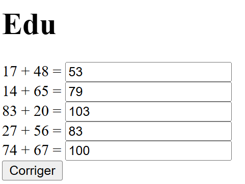
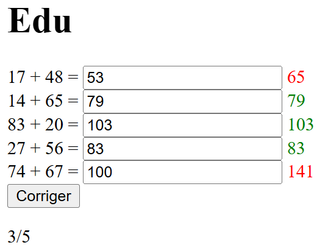

# Eval

Réaliser un composant (ou plusieurs) Vue en vous basant sur ces captures:

 

Ce composant génèrera et affichera une addition entre deux valeurs entières.
Un champ de saisie vide sera proposé à l'utilisateur afin qu'il renseigne sa réponse.
Un bouton de validation permettra d'obtenir:
- soit: le score (ex: 1/1) uniquement
- soit: la bonne réponse (le résultat de l'addition) uniquement
- soit: les deux

En option:
Générer plusieurs additions aléatoires.
